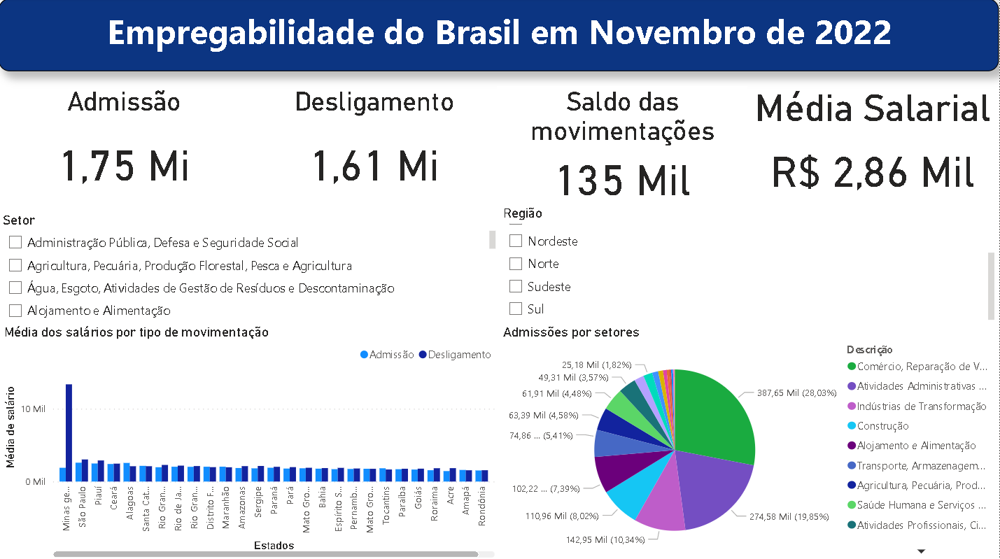

# Empregabilidade do Brasil em novembro de 2022

Para realização de politicas públicas são realizados levantamentos de questão trabalhistas para as empresas do Brasil inteiro. As informações utilizadas no dashboard produzido no Power BI, são do Novo Caged dispostivo utilizado pelo Ministério do Trabalho para obter acompanhamento situação formal da mão de obra do Brasil.

Na figura abaixo, é possível observar a tela principal do dashboard no qual é possível retirar bastantes informações referentes ao mês de novembro de 2022.

O Brasil no mês de novembro de 2022 registrou um saldo positivo, ou seja, registrou mais admissões que desligamentos no mês, com um total de 135 mil e a média salarial sendo igual a R$ 2.857,48 . O setor "Comércio, Reparação de Veículos Automotores e Motocicletas" sendo responsável por concentrar a maior número de admissões em novembro, com 28,03% do número de admissões totais. 

Na dashboard produzido é possível realizar interações, sendo possível se aprofundar mais aos dados. Na figura abaixo podemos observar de uma melhor forma, um recorte do Nordeste.

Em novembro, o Nordeste apresentou um saldo positivo de 29 mil movimentações, responsável por 21,48% dos novos postos de trabalho do Brasil. É possivel observar que mesmo com o saldo positivo, tiveram estados com fechamento negativo como o Piauí e Rio Grande do Norte. Em relação as admissões por setores, "Comércio, Reparação de Veículos Automotores e Motocicletas" continuou liderando também no nordeste, porém uma mudança na 3ª posição em que diferente do Brasil de modo geral, "Construção" teve mais admissões que "Industrias de Transformação".
